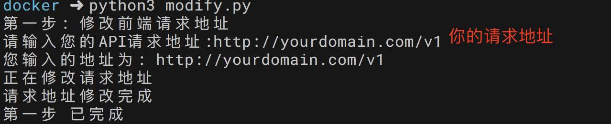
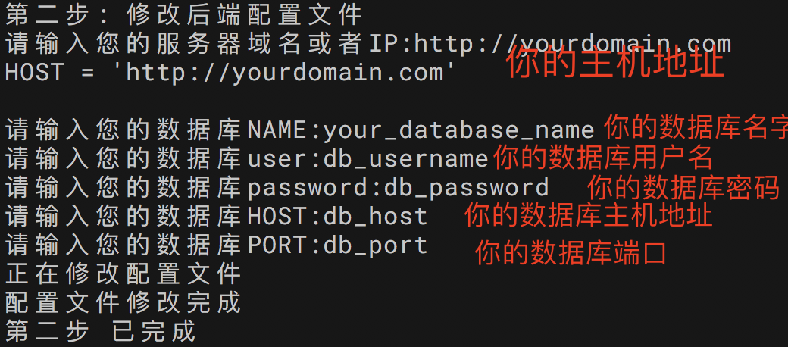
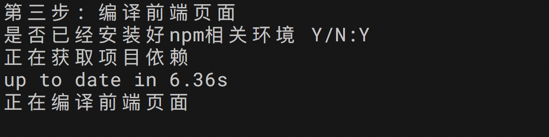

# TmallHomeassistant

## 一、前言

  感谢论坛版本的天猫精灵对接平台的灵感源泉，本项目本着娱乐自己学习的目的来做的，使用过程中出现问题请在issue中提出，再次感谢hassbian论坛中大神的帮助。希望可以一起学习。
  欢迎加入TmallHomeassistant交流群，群聊号码：814865598

## 二、 项目框架 

  由于我本身是从事python开发的工作，所以后台我选择使用了Django进行交互，同时呢最近手头上在用  [Ant Design of Vue](https://vuecomponent.github.io/ant-design/docs/vue/introduce-cn/)  做项目所以兴起就开始了这个项目的制作了，啰嗦一下，我本身做电子设计出身的后台转行到软件行业所以软硬结合我非常感兴趣，参考项目 [hassbian tmall-bot-x1](https://github.com/c1pher-cn/tmall-bot-x1)  ,话不多说，我们进入正题。

## 三、环境需求

  >· Python3 
   · NPM  
   · NGINX  
   · MYSQL  
   ·Dcoker 这个管理起来比较简单了（推荐使用）   

  简单讲一下，这些东西可能对小白来说有些困难，同时我还会提供一个托管的平台，如果你想自己按照教程做，你可以联系我或者在论坛发帖子都可以，相比而言php的确实配置简单了一些。如果你喜欢挑战自己请往下看哦。

**项目树**
>|── OauthDjango  后端项目  
>|── README.md   
>|── modify.py   自动化修改脚本   
>── oauth_page 前端页面   

#### 相关软件安装指导
1. python3.6.1安装  **安装方式采用自编译的形式** <br>
1.1安装编译环境
 ```
 $ yum install gcc       安装c编译器
 $ yum install gcc-c++    这是c++编译器
 $ yum install make       安装make
 ```
1.2下载python文件 <br>
```
$ wget https://www.python.org/ftp/python/3.6.1/Python-3.6.1.tar.xz
```
1.3 解压文件并创建安装目录
```
$ tar -xf Python-3.6.1.tar.xz
$ mkdir /usr/python3.6
```
1.4 进入文件夹准备编译
```
$ cd Python-3.6.1
$ ./configure --prefix=/usr/python3.6
$ make 
$ make install
```
1.5 等待以上步骤完成后执行
```
$ ln -s /usr/python3.6/bin/python3 /usr/bin/python3
$ python3 -V
Python 3.6.1
$ ln -s /usr/python3.6/bin/pip3 /usr/bin/pip3
$ pip3 -V
pip 9.0.1 from /usr/python3.6/lib/python3.6/site-packages (python 3.6)
```
2.下面安装 npm 
 由于前端需要用到npm包管理 所以这个必须要，但是你可以在本地编译完成后上传到服务器中，我们直接安装node.js就行了 因为它自带了npm
```
$ sudo yum install epel-release
$ sudo yum install nodejs
```
等待安装完成后，测试一下
```
$ node --version
v6.12.2
$ npm --version
3.10.10
```
3. 安装mysql数据库

#### 交互式修改相关配置

  为了方便大家配置自己的数据库 请求地址等相关参数，我特地写了一个脚本 **modify.py**,你只需要跟着步骤一步一步来就可以了

第一步

克隆本项目到本地
```shell
git clone https://github.com/yanzongzhen/TmallHomeassistant.git
```

第二步

```shell
python3 modity.py
```

接下来你会看到一下信息，请按照自己的实际情况配置相关参数

  






  经过这些配置后，这整个项目呢就是你的个人专属了，下面的工作就是部署到服务器上了，后面的工作说起来挺简单，其实也不太难，哈哈


## 四、服务器配置 

默认以linux服务器为列子

